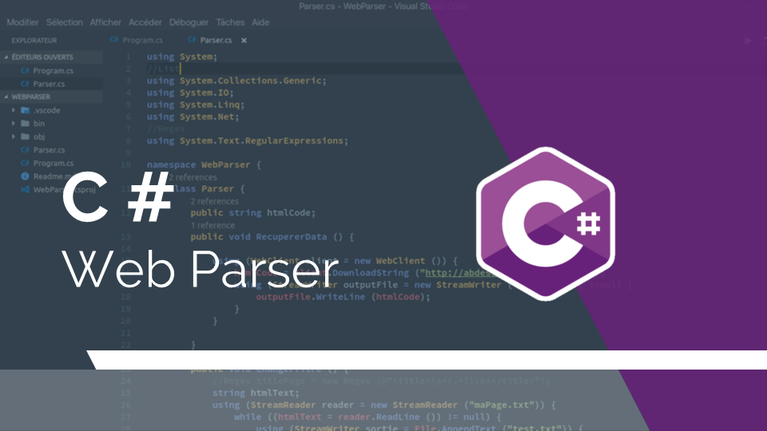

# Web Parser 

> Petit programme permettant de parser le code html d'une Page



## Objectif

Utiliser les notions vues en cours, à savoir : les fonctions, les collections, streams,...

## Instructions

1. Récuperer le code html d'une page à partir de son url dans un fichier ```.txt```
2. Passer le fichier en lecture et renommez la page ainsi que la src des images
3. Mettre tous les textes en gras
4. Supprimer tous les scripts javascript
5. Faire une recherche dans le texte du mot qui a le plus d'occurences

## Execution du programme

Ce projet a été réalisé sur Archlinux en utilisant Visual Studio Code

### Linux

Si vous êtes sous Linux vérifiez que vous avez ces paquets installés

* dotnet-host
* dotnet-runtime-2.0
* dotnet-sdk-2.0

Ensuite deplacez vous dans le dossier contenant le projet et lancez la commande :

    dotnet run

### Windows

Si vous êtes sous Windows ouvrez le dossier avec Visual Studio

L'ensemble des fichiers crées sera sur le Bureau

## Améliorations

Utilser HtmlAgilityPack pour plus de fonctionnalités

## Auteur

[Abdessalam BENHARIRA](https://github.com/Abdessalam98)
